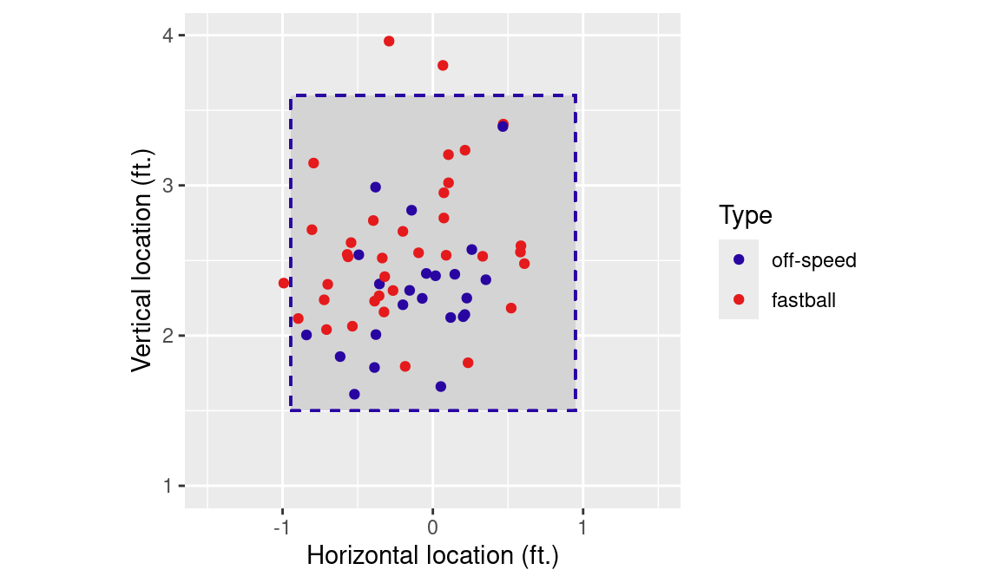

# The Baseball Datasets


**Learning objectives:**

- Bookclub overivew

- Introduction to data sets we will use for the book

## Overivew {-}

- Book: [Analyzing Baseball Data with R](https://beanumber.github.io/abdwr3e/)
- Code Repo : [adbwr3edata](https://github.com/beanumber/abdwr3edata)
- Goal: Learn how to answer baseball questions with data by learning how to:

      - Access baseball data
      
      - Manipulate and analyze baseball data with R and tidyverse.
      
      - Communicate results with quarto and shiny 
      
      
## Baseball terms {-}

Some useful resources for defintions of Baseball terms and statistics:

[MLB Glossary](https://www.mlb.com/glossary)

[Baseball reference](https://www.baseball-reference.com/about/)

[MLB Rules 2025](https://mktg.mlbstatic.com/mlb/official-information/2025-official-baseball-rules.pdf)

## Lahman Databse {-}

- Season by Season data from 1871 to current season

- Consists of multiple tables:

   - People : Player names, DOB, etc
   
   - Batting : Batting statistics by player / year / 'stint'
   
   - Pitching : Pitching statistics by player / year / 'stint'
   
   - Fielding : Fielding statistics by player / year / 'stint'
   
   - Teams : Team performance by year.
   
- Easy to use from `R` :


```{r}
library(Lahman)
library(tidyverse)
Teams |>
  slice_tail(n = 3)
```
## Example Uses for Lahman 
 
- Good for answering questions like:
   - What is the average number of home runs per game recorded in each decade? Does the rate of strikeouts show any correlation with the rate of home runs? (*Teams* table)
   
   - How does the percentage of games completed by the starting pitcher from 2000 to 2010 compare to the percentage of games 100 years before? (*Pitching* table)
   
   - Which player had the most walks per plate appearance (BB%) in a given year? (*Batting* table)


## Retrosheet Game-by-Game Data

- Game logs going back to 1871

  - Teams offensive / defensive stats, starting players, etc
  
  - All 161 fields documented [here](https://www.retrosheet.org/gamelogs/glfields.txt). 

- [Retrosheet game logs](https://www.retrosheet.org/gamelogs/index.html) are provided for each season as zipped csv files.

- Some sample data is provided in the books code repo. 

- Example question: In which months are home runs more likely to occur?

## Retrosheet Play-by-Play Data

- Event files provided for each game since 1913

- Data for each play (similar to what you might find on a baseball scoresheet). 

- [Event files](https://www.retrosheet.org/game.htm) are provided as zipped collections by season.   One file covers a teams season of games.

- [Detailed description](https://www.retrosheet.org/eventfile.htm)

- Example line:
`play,3,1,bichb001,01,CX,D8/L89XD+.1-3` 

Translation: 

>In the 3rd inning, with the visiting team (Blue Jays) at bat, Bo Bichette hit a double to center field. The ball was lined to center and involved both the center and right fielders. Due to a misplay or error, the batter advanced beyond the expected base. Additionally, a runner who was on first base advanced to third base on the play.
 `

## Accessing the data

- Retrosheet provides some (dos!) tools for parsing the data

- Instead, book recommends using tools presented in Appendix A

- Example Question: What is the Major league batting average when the ball/strike count is 0-2? What about on 2-0?

## Pitch-by-Pitch Data



- Even more detailed data: Ball release point, trajectory, location at plate, etc. 

- PITCHf/x data from 2008-2017 (?). Replaced by Statcast

- Example question: What are the chances of a successful steal when the pitcher throws a fastball compared to when a curve is delivered?

## Statcast

- Tracks more than PITCHf/x including movement of the individual players

- Limited data is provided to public by [Baseball Savant](https://baseballsavant.mlb.com)

- [Baseballr](https://billpetti.github.io/baseballr/) package provides tools to download Baseball Savant data (and more!)

At the moment, this doesn't seem to be working though with the CRAN version. Need to install the development version:

```
# Install the remotes package if you haven't already
install.packages("remotes")
remotes::install_github("BillPetti/baseballr")
```

```{r}
library(baseballr)
noah <- statcast_search(start_date = "2016-04-06",
                          end_date = "2016-04-15", 
                          playerid = 592789, 
                          player_type = 'pitcher')
```

- Example Question: How frequently do MLB teams employ infield shifts?

## Other data on baseballr

- Scrape extensive data frorm [Baseball Reference](https://www.baseball-reference.com)  and [FanGraphs](https://www.fangraphs.com)  

```{r}
library(baseballr)
bref_standings_on_date("2025-04-12", "NL East", from = FALSE)
```

- Retrosheet - but needs a special CLI (See Appendix A)

## Data used in the book

- Lahman data from `Lahman` package
- Small examples for other data are in `abdwr3edata` package
- Large examples will require downloading data seperately.

## Exercises
