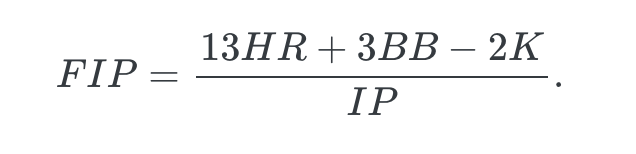
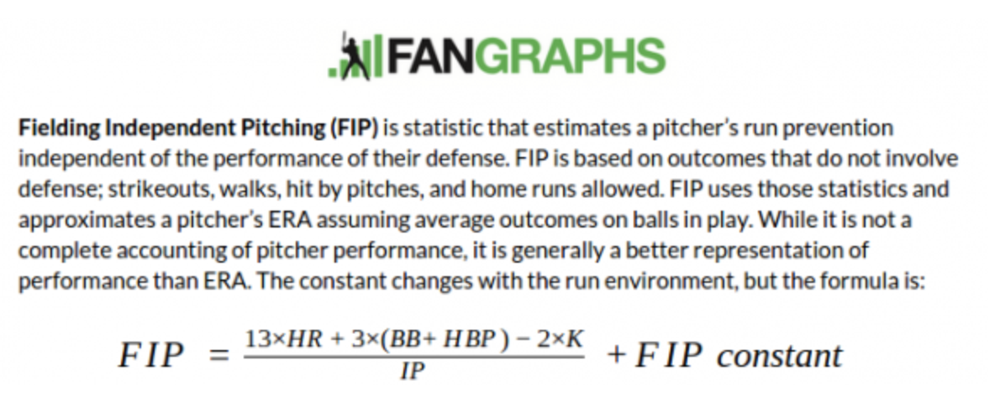

# Introduction to R

**Learning objectives:**

- Getting started with R
- Discover different ways to hold data
- Reading and writing data
- Tidyverse verbs
- Understand basic data wrangling

## Downloading and using R

- [Download R language](https://www.r-project.org/)
- [Rstudio](https://posit.co/products/open-source/rstudio/) (popular IDE)
- [Positron](https://positron.posit.co/) (new IDE)

- [Setting up macOS as an R data science rig in 2023](https://ivelasq.rbind.io/blog/macos-rig/) by Isabella Velásquez

## Tidyverse

  \


Packages that make up the Tidyverse
- **dplyr**, **ggplot2**, **tibble**, **tidyr**, **readr**, **purrr**, **stringr**, **lubridate**, **forcats**

```{r, message=FALSE, eval=TRUE}
library(tidyverse)

Lahman::Teams |> 
  dplyr::filter(teamID == "DET") |>
  dplyr::arrange(desc(yearID)) |>
  dplyr::select(yearID, name, W, L) |>
  dplyr::slice_head(n = 10)
```

Other packages for this book:

```{r, message=FALSE, eval=FALSE}
remotes::install_github("beanumber/abdwr3edata")

library(abdwr3edata)
```

## Data Frames

```{r, message=FALSE, eval=TRUE}
library(abdwr3edata)

spahn |> 
  dplyr::slice(1:3) |> 
  dplyr::select(1:10)

spahn[1:3, 1:10]
```

### Manipulations with Data

  \

```{r, message=FALSE, eval=TRUE}
spahn <- spahn |> 
  dplyr::mutate(FIP = (13 * HR + 3 * BB - 2 * SO) / IP)

spahn |> 
  dplyr::arrange(FIP) |> 
  dplyr::select(Year, Age, W, L, ERA, FIP) |>
  dplyr::slice_head(n = 5)
```

What do you notice about Spahn's FIP?



[Fangraphs library](https://www.fangraphs.com/guts.aspx?type=cn)

[Fangraphs FIP constants](https://www.fangraphs.com/guts.aspx?type=cn)

You can combine data with joins.

```{r, message=FALSE, eval=TRUE}
batting <- dplyr::bind_rows(NLbatting, ALbatting)

dplyr::dim_desc(NLbatting)
dplyr::dim_desc(ALbatting)
dplyr::dim_desc(batting)

NL <- dplyr::inner_join(NLbatting, NLpitching, by = "Tm")
dplyr::dim_desc(NLpitching)
dplyr::dim_desc(NLbatting)
dplyr::dim_desc(NL)
```


## Vectors

A sequence of values of the **same** type (e.g. numeric or character).

If you include multiple types, R will automatically force same type.

```{r, message=FALSE, eval=TRUE}
# Spahn's wins and losses after the war (this is a code comment)

W <- c(8, 21, 15, 21, 21, 22, 14)
L <- c(5, 10, 12, 14, 17, 14, 19)

win_pct <- 100 * W / (W + L)
Year <- seq(from = 1946, to = 1952) # Same: Year <- 1946:1952
```

R has a lot of built-in functions for vectors

```{r, message=FALSE, eval=TRUE}
# total wins over post-war span
sum(W)

# number of seasons post-war
length(W)

# avg. winning pct.
mean(win_pct)
```

Ways to select data with vector index and logicals.

```{r, message=FALSE, eval=TRUE}
W[c(1, 2, 5)]

W[1 : 4]

W[-c(1, 6)]
```

How many times did Spahn exceed 20 wins? What years?

```{r, message=FALSE, eval=TRUE}
W > 20

sum(W > 20)

Year[W > 20]
```

## Objects and Containers in R

Characters and data frames

```{r, message=FALSE, eval=TRUE}
Year <- 2008 : 2017
NL <- c("PHI", "PHI", "SFN", "SLN", "SFN",
        "SLN", "SFN", "NYN", "CHN", "LAN")
AL <- c("TBA", "NYA", "TEX", "TEX", "DET",
        "BOS", "KCA", "KCA", "CLE", "HOU")
Winner <- c("NL", "AL", "NL", "NL", "NL",
            "AL", "NL", "AL", "NL", "AL")
N_Games <- c(5, 6, 5, 7, 4, 7, 7, 5, 7, 7)

WS_results <- tibble::tibble(
  Year = Year, NL_Team = NL, AL_Team = AL,
  N_Games = N_Games, Winner = Winner)

WS_results

WS <- WS_results |> 
  dplyr::group_by(Winner) |> 
  dplyr::summarize(N = dplyr::n())

WS

ggplot2::ggplot(WS, ggplot2::aes(x = Winner, y = N)) + 
  ggplot2::geom_col()
```

Factors

```{r, message=FALSE, eval=TRUE}
# Alphabetical order
WS_results |> 
  dplyr::group_by(NL_Team) |> 
  dplyr::summarize(N = dplyr::n())

# Use a factor to order by division
WS_results <- WS_results |>
  dplyr::mutate(
    NL_Team = factor(
      NL_Team, 
      levels = c("NYN", "PHI", "CHN", "SLN", "LAN", "SFN")
    )
  )

# Now ordered by division
WS_results |> 
  dplyr::group_by(NL_Team) |> 
  dplyr::summarize(N = dplyr::n())
```

Lists

```{r, message=FALSE, eval=TRUE}
world_series <- list(
  Winner = Winner, 
  Number_Games = N_Games,
  Seasons = "2008 to 2017"
)

world_series
```
Many ways to pull data:

```{r, message=FALSE, eval=TRUE}
world_series$Number_Games

world_series[[2]]

purrr::pluck(world_series, "Number_Games")

world_series["Number_Games"]
```


```{r, message=FALSE, eval=TRUE}
WS_results$NL_Team

# same
dplyr::pull(WS_results, NL_Team)
```

## Collection of R Commands

```{r, eval=FALSE}
# We can save this as a script to run later

library(Lahman)
library(tidyverse)

crcblue <- "#2905a1"

ws <- SeriesPost |>
  filter(yearID >= 1903, round == "WS", wins + losses < 8)
ggplot(ws, aes(x = wins + losses)) +
  geom_bar(fill = crcblue) +
  labs(x = "Number of games", y = "Frequency")
```


```{r}
# running the script

source(here::here("scripts/WorldSeriesLength.R"), echo = TRUE)
```


```{r}
source(here::here("scripts/hr_rates.R"))

# Mickey Mantle stats ffrom 1951 to 1961

HR <- c(13, 23, 21, 27, 37, 52, 34, 42, 31, 40, 54)
AB <- c(341, 549, 461, 543, 517, 533, 474, 519, 541, 527, 514)
Age <- 19 : 29
hr_rates(Age, HR, AB)
```


## Reading and Writing Data

```{r, eval=FALSE}
# Read data
getwd()

spahn <- readr::read_csv(here::here("data/spahn.csv"))
```


```{r, eval=FALSE}
# Write data
mantle_hr_rates <- hr_rates(Age, HR, AB)
Mantle <- tibble::tibble(
  Age, HR, AB, Rates = mantle_hr_rates$y
)

readr::write_csv(Mantle, here::here("data/mantle.csv"))
```


## Packages

Currently over 20,000 packages available via CRAN

```{r, eval=FALSE}
# Install package
install.packages("Lahman")

library(Lahman)
```


Can also download packages via Github

```{r, eval=FALSE}
remotes::install_github("beanumber/abdwr3edata")

library(abdwr3edata)
```

Use question mark to learn more about package contents

```{r, eval=FALSE}
# to learn more about the Batting data set in Lahman
?Batting
```


## Splitting, Applying, and Combining Data

```{r}
library(Lahman)

Batting |> 
  dplyr::filter(yearID >= 1960, yearID <= 1969) |>
  dplyr::group_by(playerID) |> 
  dplyr::summarize(HR = sum(HR)) |>
  dplyr::arrange(desc(HR)) |>
  dplyr::slice(1:4)
```
What if we want to find the top HR hitters for each decade?

```{r}
hr_leader <- function(data) {
  data |> 
    dplyr::group_by(playerID) |> 
    dplyr::summarize(HR = sum(HR)) |>
    dplyr::arrange(desc(HR)) |>
    dplyr::slice(1)
}
```

Do you see any potential issues with this function?

```{r}
Batting_decade <- Batting |>
  dplyr::mutate(decade = 10 * floor(yearID / 10)) |>
  dplyr::group_by(decade)

decades <- Batting_decade |>
  dplyr::group_keys() |>
  dplyr::pull("decade")

decades
```

```{r}
Batting_decade |>
  dplyr::group_split() |>
  purrr::map(hr_leader) |>
  purrr::set_names(decades) |>
  dplyr::bind_rows(.id = "decade")
```

## Getting Help

```{r}
# Will open documentation for the function
?geom_point
```

```{r}
# find all objects that contain this character string
??geom_point
```


## Further Reading

- [R for Data Science (2e)](https://r4ds.hadley.nz/)
- [Modern Data Science with R](https://www.routledge.com/Modern-Data-Science-with-R/Baumer-Kaplan-Horton/p/book/9780367191498) $$
- [A Modern Dive into R and the Tidyverse](https://moderndive.com/)
- [R for the Rest of Us](https://book.rfortherestofus.com/)
- [R Packages](https://r-pkgs.org/)
- [Happy Git and GitHub for the useR](https://happygitwithr.com)


