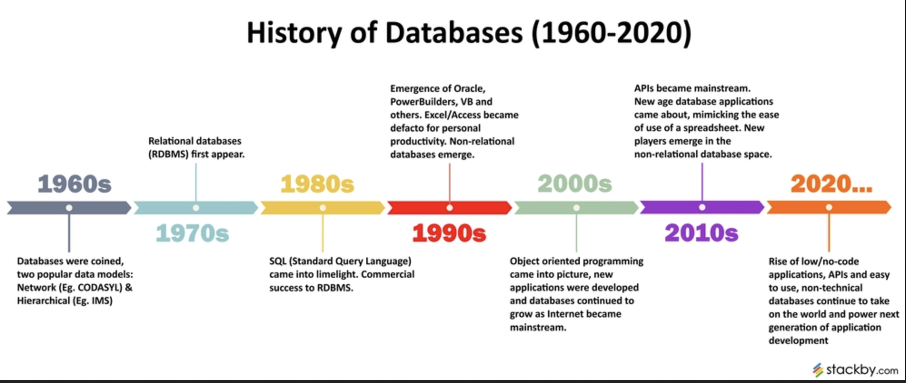
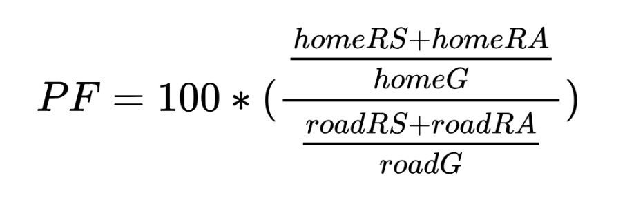
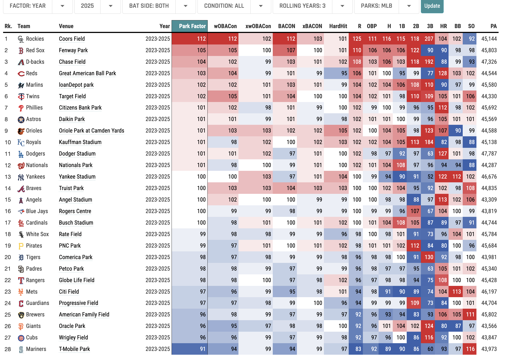

# Using a Database to Compute Park Factors

**Learning objectives:**

-   Installing and creating a MySQL database
-   Create a MySQL Game Log database
-   Querying the database from R
-   Building your own baseball database
-   Park factors

```{r setup_ch_11, message = FALSE, warning = FALSE}
suppressMessages(library(tidyverse))
# library(RPostgres) # using PostgreSQL instead of MariaDB
library(baseballr)
library(ggstatsplot)
theme_set(theme_classic())

crcblue <- "#2905a1"

crc_fc <- c("#2905a1", "#e41a1c", "#4daf4a", "#984ea3")

options(digits = 3)
```

## Introduction



-   The big data problem
-   One solution: RDBMS (Relational Database Management System)
-   Popular choices: MySQL, MariaDB, PostgreSQL, SQLite
-   SQL (Structured Query Language)

## Connecting R with MySQL using PostgreSQL

```{r connect_to_postgresql}
# con <- dbConnect(Postgres(), 
#                  dbname = "abdwr", 
#                  host = "db-postgresql-nyc3-47385-do-user-23288491-0.h.db.ondigitalocean.com", 
#                  port = 25060, 
#                  user = "abdwr", 
#                  password = "AVNS_7g2vMFKX9yy1rDDJBeZ")
# 
# class(con)
```

## Filling a MySQL Game Log Database from R

```{r retrosheets}
# retrosheet_gamelog <- function(season) {
#      require(abdwr3edata)
#      require(fs)
#      dir <- tempdir()
#      glheaders <- retro_gl_header
#      remote <- paste0(
#           "http://www.retrosheet.org/gamelogs/gl", 
#           season, 
#           ".zip"
#      )
#      local <- path(dir, paste0("gl", season, ".zip"))
#      download.file(url = remote, destfile = local)
#      unzip(local, exdir = dir)
#      local_txt <- gsub(".zip", ".txt", local)
#      gamelog <- here::here(local_txt) |>
#           read_csv(col_names = names(glheaders))
#      file.remove(local)
#      file.remove(local_txt)
#      return(gamelog)
# }

# retrosheet for 2012 season
# gl2012 <- retrosheet_gamelog(2012)

gl2012 <- read_rds('./data/gl2012.rds')

gl2012 |> 
     glimpse()
```

## From R to MySQL

```{r gamelogs}
# if (dbExistsTable(con, "gamelogs")) {
#      dbRemoveTable(con, "gamelogs")
# }
# 
# con |>
#      dbWriteTable(
#           name = "gamelogs",  # Ensures compatibility with reserved words or case sensitivity
#           value = gl2012,
#           append = FALSE,
#           field.types = c(
#                CompletionInfo = "VARCHAR(50)", 
#                AdditionalInfo = "VARCHAR(255)",
#                HomeBatting1Name = "VARCHAR(50)",
#                HomeBatting2Name = "VARCHAR(50)",
#                HomeBatting3Name = "VARCHAR(50)",
#                HomeBatting4Name = "VARCHAR(50)",
#                HomeBatting5Name = "VARCHAR(50)",
#                HomeBatting6Name = "VARCHAR(50)",
#                HomeBatting7Name = "VARCHAR(50)",
#                HomeBatting8Name = "VARCHAR(50)",
#                HomeBatting9Name = "VARCHAR(50)",
#                HomeManagerName = "VARCHAR(50)",
#                VisitorStartingPitcherName = "VARCHAR(50)",
#                VisitorBatting1Name = "VARCHAR(50)",
#                VisitorBatting2Name = "VARCHAR(50)",
#                VisitorBatting3Name = "VARCHAR(50)",
#                VisitorBatting4Name = "VARCHAR(50)",
#                VisitorBatting5Name = "VARCHAR(50)",
#                VisitorBatting6Name = "VARCHAR(50)",
#                VisitorBatting7Name = "VARCHAR(50)",
#                VisitorBatting8Name = "VARCHAR(50)",
#                VisitorBatting9Name = "VARCHAR(50)",
#                VisitorManagerName = "VARCHAR(50)",
#                HomeLineScore = "VARCHAR(30)",
#                VisitorLineScore = "VARCHAR(30)",
#                SavingPitcherName = "VARCHAR(50)",
#                ForfeitInfo = "VARCHAR(10)",
#                ProtestInfo = "VARCHAR(10)",
#                UmpireLFID = "VARCHAR(8)",
#                UmpireRFID = "VARCHAR(8)",
#                UmpireLFName = "VARCHAR(50)",
#                UmpireRFName = "VARCHAR(50)"
#           )
#      )

# verify if the data resides in MySQL server
# gamelogs <- con |>
#      tbl("gamelogs")
```

## Downloading retrosheet files from 1995 to 2017

```{r append_gamelogs}
# append_game_logs <- function(conn, season) {
#      message(paste("Working on", season, "season..."))
#      one_season <- retrosheet_gamelog(season)
#      conn |>
#           dbWriteTable(
#                name = "gamelogs", value = one_season, append = TRUE
#           )
# }
# 
# # filter for 1995 to 2017 seasons
# dbSendQuery(con, "TRUNCATE TABLE gamelogs;")
# 
# map(1995:2017, append_game_logs, conn = con)
gamelogs <- read_rds('./data/gamelogs_1995_2017_sel.rds')

head(gamelogs) |> 
     as_tibble() |> 
     glimpse()
```

## SQL

```{r sql_1}
# query <- '
# SELECT
#     SUBSTRING("Date"::text FROM 1 FOR 4) AS year,
#     COUNT(*) AS num_games
# FROM
#     gamelogs
# GROUP BY
#     year
# ORDER BY
#     year;
# '

# dbGetQuery(con, query)

# using tidyverse
gamelogs |> 
  mutate(year = Date %>% str_sub(1, 4)) |> 
  count(year) |> 
  print(n = 30)

# gamelogs object type
# class(gamelogs)

# gamelogs |> 
#      glimpse()

# number of rows in gamelogs
# query <- "
# SELECT COUNT(*) 
# FROM gamelogs;
# "
# 
# dbGetQuery(con, query)
nrow(gamelogs)
```

## Querying Data from R

Let's compare the attendance of two Chicago teams by day of the week since the 2006 season. - CHA - Chicago White Sox - CHN - Chicago Cubs

```{r sql_2}
# query <- '
# SELECT "Date", "HomeTeam", "DayOfWeek", "Attendance"
# FROM "gamelogs"
# WHERE ("Date" > 20060101.0) 
#      AND ("HomeTeam" IN (\'CHN\', \'CHA\'))
# '
# 
# chi_attendance <- dbGetQuery(con, query) 
# slice_head(chi_attendance, n = 6)

# using dplyr (tidyverse)
chi_attendance <- gamelogs |>
     filter(Date > 20060101, HomeTeam %in% c('CHN', 'CHA')) |>
     select(Date, HomeTeam, DayOfWeek, Attendance)

chi_attendance |> 
  head()

# show_query()
# gamelogs |>
#      filter(Date > 20060101, HomeTeam %in% c('CHN', 'CHA')) |>
#      select(Date, HomeTeam, DayOfWeek, Attendance) |>
#      show_query()
```

Another exercise: let's compare for New York Yankees and Mets daily average attendance.

```{r comp_NYN_NYA}
gamelogs |>
     filter(Date >= 20060101, Date <= 20061101, HomeTeam %in% c('NYN', 'NYA')) |>
     select(Date, HomeTeam, DayOfWeek, Attendance) |> 
     group_by(HomeTeam, DayOfWeek) |> 
     summarise(average_attendance = mean(Attendance, na.rm = TRUE), 
               .groups = 'drop') |> 
     as_tibble() |> 

     mutate(dayofweek = DayOfWeek %>% 
                 factor(levels = c('Mon', 'Tue', 'Wed', 'Thu', 'Fri', 'Sat', 'Sun'), 
                        ordered = TRUE)) |> 
     arrange(HomeTeam, dayofweek) |> 
     
     # plot attendance by team
     ggplot(aes(x = dayofweek, y = average_attendance, fill = HomeTeam)) + 
     geom_col(position = 'dodge') + 
     scale_fill_manual(values = c(crc_fc[1], crc_fc[2])) + 
     labs(
       x = NULL, 
       y = 'Average Attendance', 
       title = 'Daily Average Attendance betweeb NY Yankees & NY Mets for 2016 season'
         ) + 
    theme_classic()
```

## Data cleaning

Coerce date to correct format, replace attendance missing values with 0

```{r data_cleaning}
chi_attendance <- chi_attendance |>
     mutate(
          the_date = ymd(Date),
          Attendance = na_if(Attendance, 0)
     )
```

Chicago ballpark attendance comparison

```{r chicago_comparison}
chi_attendance |> 
     ggplot(aes(
          x = wday(the_date), y = Attendance, 
          color = HomeTeam
          )
     ) +
     geom_jitter(height = 0, width = 0.2, alpha = 0.2) + 
     geom_smooth() + 
     scale_y_continuous("Attendance") + 
     scale_x_continuous(
          "Day of the Week", breaks = 1:7, 
          labels = wday(1:7, label = TRUE)
     ) + 
     scale_color_manual(values = crc_fc)
```

## Coors Field and run scoring


Batting Park Factors (BPF)

"*is a baseball statistic that indicates the difference between runs scored in a team's home and road games*" - Wikipedia

The formula most common used is:



Look at the games played by the Rockies---either at home or on the road---since 1995.

```{r rockies_games}
# query <- '
# SELECT "Date", "ParkID", "VisitingTeam", "HomeTeam", 
#   "VisitorRunsScored" AS awR, "HomeRunsScore" AS hmR
# FROM "gamelogs"
# WHERE ("HomeTeam" = \'COL\') OR ("VisitingTeam" = \'COL\') 
#   AND "Date" > 19950000;
# '
# 
# rockies_games <- dbGetQuery(con, query)

rockies_games <- gamelogs |> 
  select(Date, ParkID, VisitingTeam, HomeTeam, 
         awR = VisitorRunsScored, 
         hmR = HomeRunsScore) |> 
  filter(HomeTeam == 'COL' | VisitingTeam == 'COL', 
         Date > 19950000)

head(rockies_games, 10)
```

Compute the sum of runs scored in each game by adding the runs scored by the home team and the visiting team. We also add a new column `coors` indicating whether the game was played at Coors Field.

```{r coors_field_runs}
rockies_games <- rockies_games |>
     mutate(
          runs = awR + hmR, 
          coors = ParkID == "DEN02"
     )

head(rockies_games, 10)
```

Now, let's compare the offensive output by the Rockies and their opponents at Coors and other ballparks.

```{r other_parks_runs}
rockies_games |> 
     ggplot(aes(x = year(ymd(Date)), y = runs, color = coors)) +
     stat_summary(fun.data = "mean_cl_boot") + 
     xlab("Season") +
     ylab("Runs per game (both teams combined)") +
     scale_color_manual(
          name = "Location", values = crc_fc,
          labels = c("Other", "Coors Field")
     )
```

Another approach using `ggbetweenstats()` from the `ggstatsplot` package.

```{r ggbetweenstats}
set.seed(1234)
rockies_games |> 
     ggbetweenstats(
          x = coors, 
          y = runs
     )
```

## Calculating Basic Park Factors

Retrosheets from 1990 to 1999 season

```{r retrosheet_1990_1999}
# retro_data <- baseballr::retrosheet_data(
#      path_to_directory = here::here("data/retrosheet"),
#      1990:1999
# ) 
# 
# events <- retro_data |>
#      map(pluck, "events") |>
#      bind_rows() |>
#      as_tibble()
# 
# con |>
#      dbWriteTable(name = "events", value = events)

# events_db <- con |>
#      tbl("events")
```

Select the columns containing the home and away teams and the event code from the events table, keeping only the rows where the year is 1996 and the event code corresponds to one indicating a batted ball.

```{r home_away_teams}
# query <- '
# SELECT "away_team_id", LEFT("game_id", 3) AS "home_team_id", "event_cd"
# FROM "events"
# WHERE "year" = 1996
#   AND "event_cd" IN (2, 18, 19, 20, 21, 22, 23);
# '

# hr_PF <- dbGetQuery(con, query)
hr_PF <- read_rds('./data/hr_PF.rds')

dim(hr_PF)

hr_PF |> 
  head()
```

## Home run park factor

Explore the stadium effect on home runs in 1996.

```{r home_runs_1996}
hr_PF <- hr_PF |>
     mutate(was_hr = ifelse(event_cd == 23, 1, 0))

hr_PF |> 
  head()
```

Compute the frequency of home runs per batted ball for all MLB teams both at home and on the road.

```{r freq_home_runs}
ev_away <- hr_PF |>
     group_by(team_id = away_team_id) |>
     summarize(hr_event = mean(was_hr)) |>
     mutate(type = "away")

ev_home <- hr_PF |>
     group_by(team_id = home_team_id) |>
     summarize(hr_event = mean(was_hr)) |>
     mutate(type = "home")
```

Combine the two resulting data frames and use the `pivot_wider()` function to put the home and away home run frequencies side-by-side.

```{r pivot_wide_home_away_home_runs}
ev_compare <- ev_away |>
     bind_rows(ev_home) |>
     pivot_wider(names_from = type, values_from = hr_event)

ev_compare |> 
  head(10)
```

Compute the 1996 home run park factors with the the following code, and use `arrange()` to display the ballparks with the largest and smallest park factors.

```{r comp_ballparks_1996_top_pf}
ev_compare <- ev_compare |>
     mutate(pf = 100 * home / away)

ev_compare |>
     arrange(desc(pf)) |>
     slice_head(n = 6)
```

Coors Field is at the top of the HR-friendly list, displaying an extreme value of 158---this park boosted home run frequency by over 50% in 1996!

```{r comp_ballpraks_1996_bottom_pf}
ev_compare |>
     arrange(pf) |>
     slice_head(n = 6)
```

Dodger Stadium in Los Angeles, featuring a home run park factor of 71, meaning that it suppressed home runs by nearly 30% relative to the league average park.

```{r hr-pf-plot}
# lollipop chart
ev_compare |> 
     arrange(pf) |> 
     mutate(
          pf_flag = ifelse(pf > 100, TRUE, FALSE)
     ) |> 
     
     ggplot(aes(x = pf, y = reorder(team_id, pf), color = pf_flag)) + 
     geom_segment(aes(x = 100, y = team_id, xend = pf, yend = team_id)) + 
     geom_point() + 
     scale_color_manual(values = c(crc_fc[2], crc_fc[1])) + 
     labs(
          x = 'Home Run Park Factor', 
          y = NULL, 
          title = '1996 Seaons Home Run Park Factor by Team'
     ) + 
     theme_classic() + 
     theme(legend.position = "none")
```

How has the PF (Park Factors) rating change since?



## Applying park factors

Let's retrieve Andrés Galarraga's 1996 plate appearances ending with a batted ball, and \# defining a column was_hr is defined indicating whether the event was a home run.

```{r galarraga_home_runs}
# query <- '
# SELECT "away_team_id", LEFT("game_id", 3) AS "home_team_id", "event_cd"
# FROM "events"
# WHERE "year" = 1996
#   AND "event_cd" IN (2, 18, 19, 20, 21, 22, 23)
#   AND "bat_id" = \'galaa001\';
# '
# 
# andres <- dbGetQuery(con, query) |>
#      mutate(was_hr = ifelse(event_cd == 23, 1, 0))
andres <- read_rds('./data/andres.rds')

head(andres, 20)
```

Now, let's calculate the pakr factor for Galarraga.

```{r galarraga_pf}
andres_pf <- andres |>
     inner_join(ev_compare, by = c("home_team_id" = "team_id")) |>
     summarize(mean_pf = mean(pf))

andres_pf
```

The `mean_pf` indicates that Galarraga ad his home run frequency increased by an estimated 29% relative to a neutral environment.

```{r home_runs_avg}
sum(andres$was_hr) / (andres_pf / 100)
```

According to our estimates, Galarraga's benefit from the ballparks he played in (particularly his home Coors Field) amounted to roughly `47 -36 = 11` home runs in the 1996 season.

## Exercises

### 1. Runs Scored at the Astrodome

```{r astro_runs_scored}
# dbSendQuery(con, "TRUNCATE TABLE gamelogs;")
# map(1965:1999, append_game_logs, conn = con)
# 
# query <- '
# SELECT
#     SUBSTRING("Date"::text FROM 1 FOR 4) AS year,
#     COUNT(*) AS num_games
# FROM
#     gamelogs
# GROUP BY
#     year
# ORDER BY
#     year;
# '
# 
# dbGetQuery(con, query)
```

Select games featuring the Astros (as either the home or visiting team) during the years when the Astrodome was their home park (i.e., from 1965 to 1999) using dplyr to get SQL query.

```{r astro_query}
# gamelogs |> 
#      select(Date, ParkID, HomeTeam, VisitingTeam, HomeRunsScore, VisitorRunsScored) |> 
#      filter(HomeTeam == 'HOU' | VisitingTeam == 'HOU') |> 
#      show_query()
# 
# query <- '
# SELECT
#   "Date",
#   "ParkID",
#   "HomeTeam",
#   "VisitingTeam",
#   "HomeRunsScore",
#   "VisitorRunsScored"
# FROM "gamelogs"
# WHERE ("HomeTeam" = \'HOU\' OR "VisitingTeam" = \'HOU\');
# '

# astros <- dbGetQuery(con, query) |> 
#      mutate(
#           total_runs_scored = HomeRunsScore + VisitorRunsScored, 
#           astrodome = ParkID == "HOU02"
#           )
astros <- read_rds('./data/astros.rds')

head(astros, 10)
```

### 2. Draw a plot to visually compare through the years the runs scored (both teams combined) in games played at the Astrodome and in other ballparks.

```{r plot_astros_others}
astros |> 
     select(Date, total_runs_scored, astrodome) |> 
     
     ggplot(aes(x = year(ymd(Date)), y = total_runs_scored, color = astrodome)) + 
     stat_summary(fun.data = "mean_cl_boot") + 
     xlab("Season") +
     ylab("Runs per game (both teams combined)") +
     scale_color_manual(
          name = "Location", values = crc_fc,
          labels = c("Other parks", "Astrodome")
     )
```

Another visualization (ggbetweenstats)

```{r plot_2}
set.seed(1234)
astros |> 
     ggbetweenstats(
          x = astrodome, 
          y = total_runs_scored
     )
```

```{r plot_3}
astros |> 
     group_by(year(ymd(Date)), astrodome) |> 
     summarise(
          avg_runs = mean(total_runs_scored), .groups = 'drop'
          ) |> 
     rename(date = 1) |> 
     pivot_wider(
          id_cols = 'date', 
          names_from = 'astrodome', 
          values_from = 'avg_runs'
     ) |> 
     rename('Other_parks' = 2, Astrodome = 3) |> 
     mutate(delta = Other_parks - Astrodome) |> 
     
     ggplot(aes(x = date, y = delta)) + 
     geom_point(size = 2, color = 'steelblue') + 
     geom_hline(yintercept=0, linetype="dashed", color = "red")
```

Disconnect db connection

```{r disconnect_db}
# dbDisconnect(conn = con)
```
