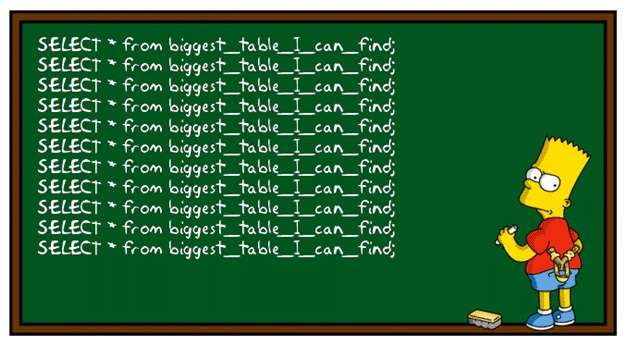
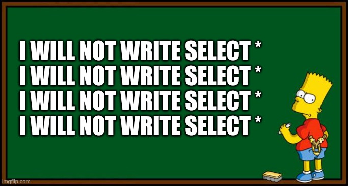
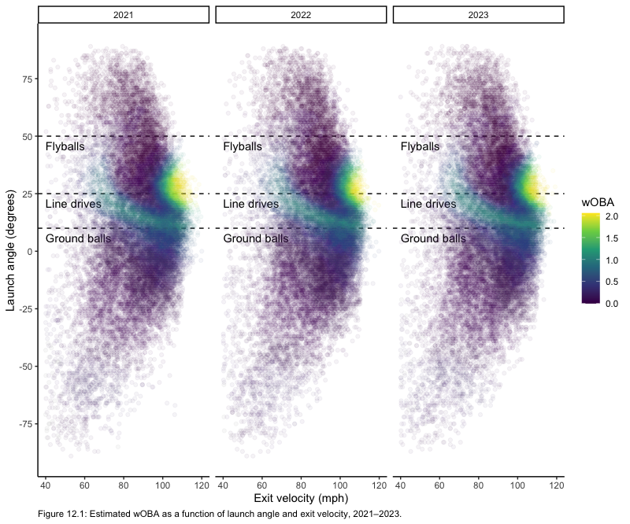

# Working with Large Data

**Learning objectives:**

-   Retrieving Statcast (Baseball Savant) multiple seasons data
-   Using Apache Arrow and Parquet format
-   Using DuckDB
-   Using MySQL (PostgreSQL)
-   Launch Angles and Velocities, Revisited

```{r setup_ch_11, message = FALSE, warning = FALSE}
suppressMessages(library(tidyverse))
# library(RPostgres) # using PostgreSQL instead of MariaDB
library(abdwr3edata)
library(baseballr)
library(fs)
theme_set(theme_classic())

crcblue <- "#2905a1"

crc_fc <- c("#2905a1", "#e41a1c", "#4daf4a", "#984ea3")

options(digits = 3)

options(timeout = max(600, getOption("timeout")))
```

## Introduction





-   Chapter 11 - Introduction to MySQL for building baseball databases
-   How to use `abdwr3edata` package functions to retrieve mutliple seasons data
-   Using R's (.rds) internal data format
-   Using Apache arrow and parquet data formats
-   Using DuckDB (OLAP)

## Acquiring a Year's Worth of Statcast Data

Let's say that we want to retrieve the full 2023 season data from Statcast.

```{r statcast_2023}
# getting 2023 season statcast data
# data_dir <- "./data"
# statcast_dir <- path(data_dir, "sc_2023")
# if (!dir.exists(statcast_dir)) {
#      dir.create(statcast_dir)
# }
# 
# statcast_season(year = 2023, dir = statcast_dir)
# 
# sc2023 <- statcast_dir |> 
#      statcast_read_csv(pattern = "sc_2023.+\\.csv")
```

Do the same process for the 2021 and 2022 season, changing the corresponding year.

Now, let's verify the validity of the 2023 season data.

```{r verify_2023_data}
tempfile_loc <- tempfile()
url <- 'https://statcast-data.atl1.digitaloceanspaces.com/statcast_2023.rds'
download.file(url, tempfile_loc)

sc2023 <- read_rds(tempfile_loc)

dim(sc2023)

sc2023 |> 
  head() |> 
  glimpse()
```

```{r sc2023}
sc2023 |>
     group_by(game_type) |>
     summarize(
          num_games = n_distinct(game_pk),
          num_pitches = n(),
          num_hr = sum(events == "home_run", na.rm = TRUE)
     )
```

## Storing Large Data Efficiently

A full season of Statcast data contains over 700k rows and nearly 118 variables.

```{r sc2023_size}
sc2023 |> 
  object.size() |> 
  print(units = "MB")
```

The total memory size is around 643MB. The CSVs occupy around 72% of the data stored into memory.

## Using R's internal data format

```{r statcast_rds}
# disk_space_rds <- path("./data") |>
#      dir_info(regexp = "statcast.*\\.rds") |>
#      select(path, size) |>
#      mutate(
#           path = path_file(path),
#           format = "rds"
#      )
# 
# disk_space_rds
```

## Using Apache Arrow and Apache Parquet

Watch the demo in the video.

## Using DuckDB

Watch the demo in the video.

## Performance Comparison

### Computational speed

```{r computational_speed_results}
res <- read_rds('./data/res.rds')

res |> 
  select(1:8) |> 
  knitr::kable()
```

### Memory footprint

```{r memory_footprint}
#        tbl      arrow     duckdb 
# 2004855136        504      51352 
```

### Disk storage footprint

```{r disk_storage_fooprint}
# A tibble: 3 × 2
#   format    footprint
#   <chr>   <fs::bytes>
# 1 duckdb        1.95G
# 2 parquet     350.46M
# 3 rds         211.92M
```

### Overall guidelines

-   If your data is small (i.e., less than a couple hundred megabytes), just use CSV because it's easy, cross-platform, and versatile.
-   If your data is larger than a couple hundred megabytes and you're just working in R (either by yourself or with a few colleagues), use .rds because it's space-efficient and optimized for R.
-   If your data is around a gigabyte or more and you need to share your data files across different platforms (i.e., not just R but also Python, etc.) and you don't want to use a SQL-based RDBMS, store your data in the Parquet format and use the arrow package.
-   If you want to work in SQL with a local data store, use DuckDB, because it offers more features and better performance than RSQLite, and doesn't require a server-client architecture that can be cumbersome to set up and maintain.
-   If you have access to a RDBMS server (hopefully maintained by a professional database administrator), use the appropriate DBI interface (e.g., RMariaDB, RPostgreSQL, etc.) to connect to it.

## Launch Angles and Exit Velocities, Revisited

Consider what happens when we ask the database to give us all the data for a particular player, say Pete Alonso, in a particular year, say 2021.

```{r pete_alonso_res}
read_bip_data <- function(tbl, begin, end = begin, 
                          batter_id = 624413) {
  x <- tbl |>
    mutate(year = year(game_date)) |>
    group_by(year) |>
    filter(type == "X", year >= begin, year <= end) |> 
    select(
      year, game_date, batter, launch_speed, launch_angle,
      estimated_ba_using_speedangle,
      estimated_woba_using_speedangle
    ) 
  if (!is.null(batter_id)) {
    x <- x |>
      filter(batter == batter_id)
  }
  x |>
    collect()
}

pete_alonso_res <- read_rds('./data/pete_alonso_res.rds')

pete_alonso_res |> 
  knitr::kable()
```

### Launches angles over time



## Further reading

Wickham, Hadley, Mine Çetinkaya-Rundel, and Garrett Grolemund. 2023. R for Data Science. 2nd ed. Sebastapol, CA: O'Reilly Media, Inc. <https://r4ds.hadley.nz/>.
