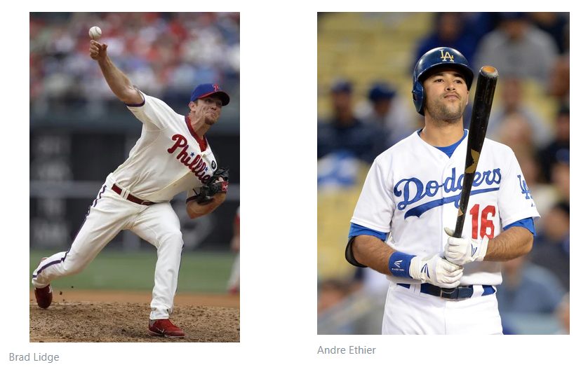
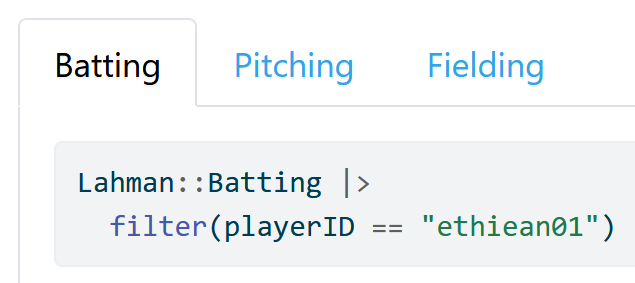
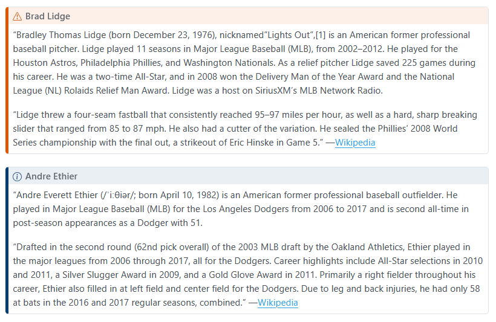
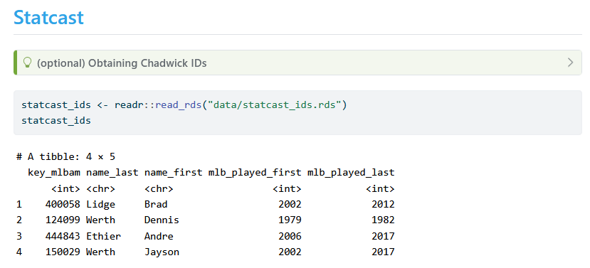
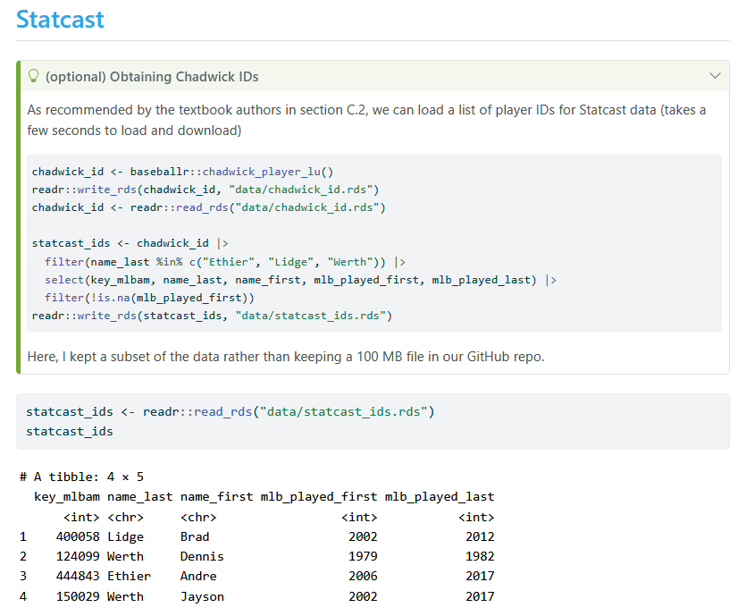

# Making a Scientific Presentation using Quarto

**Learning objectives:**

- use headers
- arrange into columns
- deploy tab sets
- create slideshows

## Sections

We can delineate sections in our presentation using markdown **headers**

```{r}
#| echo: true
#| eval: false

# Major League Baseball
## National League
### East Division
#### Philadelphia Phillies
##### Pitchers
###### Brad Lidge
```

## Math (LaTeX)

```{r}
#| echo: true
#| eval: false

$$BA = \frac{H}{AB}, \quad ERA = \frac{ER}{IP} \cdot 9$$
```

$$BA = \frac{H}{AB}, \quad ERA = \frac{ER}{IP} \cdot 9$$

## Columns

```{r}
#| echo: true
#| eval: false

:::: {.columns}

::: {.column width="45%"}

:::

::: {.column width="10%"}
	
:::

::: {.column width="45%"}

:::

::::
```




## Tabsets

```{r}
#| echo: true
#| eval: false

::::: {.panel-tabset}

### Batting

#```{r}
#Lahman::Batting |>
#  filter(playerID == "ethiean01")
#```

### Pitching

#```{r}
#Lahman::Pitching |>
#  filter(playerID == "lidgebr01")
#```

### Fielding


#```{r}
#Lahman::Fielding |>
#  filter(playerID == "werthja01")
#```

:::::
```




## Callout Boxes

```{r}
#| echo: true
#| eval: false

::: {.callout-warning}
## Brad Lidge

content

:::

::: {.callout-note}
## Andre Ethier

content
:::
```



### Collapsible Callout Boxes



```{r}
#| echo: true
#| eval: false

::: {.callout-tip collapse="true"}
## (optional) Obtaining Chadwick IDs

#content
#```

:::
```



## Slideshows

```{r}
#| echo: true
#| eval: false

---
title: "Andre Ethier versus Brad Lidge"
author: ""
date: "2025-07-16"
format:
  revealjs:
    scrollable: true
    theme: league
    toc: false
# format:
#   html:
#     toc: true
---
```
